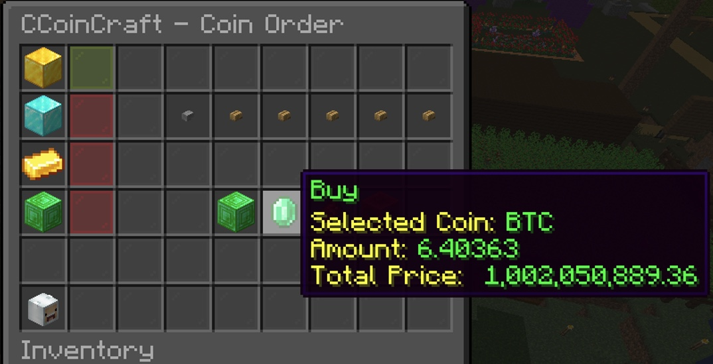

# CCoinCraft (CCC)
**마인크래프트 비트코인 채굴 & 거래 플러그인**  
*(Spigot 1.13+ 호환, Vault 연동 및 SQLite 사용)*

---

## 프로젝트 소개
`CCoinCraft (ChanHyeok Coin Craft)`는 마인크래프트 환경에서 비트코인을 직접 채굴하고, 게임 내 경제(Vault 통화) 및 실제 시세(코인게코)와 연동하여 구매/판매/송금 등의 기능을 제공하는 플러그인입니다.  
1.13 버전 이상에서 동작하며, Spigot 기반 서버에서 테스트되었습니다.  
추후 디스코드 연동 및 GUI(DeluxeMenu 기반) 확장을 지원할 수 있도록 설계되어 있습니다.

---

## 주요 기능

1. **비트코인 채굴**  
   - 특정 광물(석탄, 철, 금, 다이아몬드, 에메랄드 등)을 채굴 시 설정된 확률에 따라 비트코인을 지급  
   - 지급되는 사토시(비트코인 단위)와 확률은 `config.yml`에서 조정 가능

2. **비트코인 거래 (명령어 기반)**  
   - `/ccc btc buy <수량>`: 서버 화폐로 비트코인을 구매  
   - `/ccc btc sell <수량>`: 보유한 비트코인을 서버 화폐로 판매  
   - `/ccc btc send <플레이어> <수량>`: 다른 플레이어에게 비트코인 송금

3. **관리자 전용 명령어**  
   - `/ccc btc give <플레이어> <수량>`  
   - `/ccc btc set <플레이어> <수량>`  
   - `/ccc btc take <플레이어> <수량>`  
   - 플레이어의 비트코인 잔고 직접 수정 가능 (기록은 모두 DB에 저장)

4. **Vault 연동**  
   - 비트코인을 서버 경제(Vault) 통화와 연동하여,  
   - 명령어로 비트코인을 구매/판매할 때 Vault API 통해 화폐 차감/지급

5. **SQLite DB 연동**  
   - 플레이어 보유 코인, 거래 내역, 관리자 조작 로그 등을 DB에 저장  
   - DB 파일(`database.db`)은 Queue를 통해 비동기로 접근해 서버 렉 방지

6. **PAPI 지원(플레이어 가진 비트코인 표시)**  
   - PlaceholderAPI(선택) 사용 시, 플레이어가 가진 비트코인 표시 가능  
   - 예: `%ccoincraft_balance%` (추후 실제 플러그인 구현에 따라 값 변동)

7. **GUI 지원**  
   - `/ccc gui` 명령어 입력 시 인터페이스(DeluxeMenu 기반 혹은 커스텀 GUI) 표시  
   - 현재 비트코인 잔액, 코인 시세, 구매/판매/송금 등 메뉴를 GUI로 간편히 이용 가능  
   - 예시 스크린샷 파일: `images/cCoinCraft_GUI.png` (사용자 깃허브 리포지토리에 업로드하여 README에서 참조)

8. **추후 기능**  
   - **디스코드 연동**: 디스코드 채널 알림(채굴/거래), 관리자 명령어, 실시간 시세 조회  
   - **다른 코인 지원**: ETH, DOGE, USDT 등 GUI에서 구매/판매 가능

---

## 폴더 구조

플러그인 메인 Java 패키지는 `org.lch.cCoinCraft`이며, 주요 클래스들은 아래와 같습니다:

```
src/
└── main/
    └── java/
        └── org/
            └── lch/
                └── cCoinCraft/
                    ├── CCoinCraft.java                 (메인 플러그인 클래스)
                    ├── commands/
                    │   ├── CccCommand.java             (기본 /ccc 명령어 처리)
                    │   └── CccCommandTabCompleter.java (탭 완성)
                    ├── database/
                    │   ├── BtcHistoryDAO.java
                    │   ├── DatabaseManager.java
                    │   ├── HistoryDAO.java
                    │   ├── PlayerDAO.java
                    │   └── QueryQueue.java             (비동기 DB 처리)
                    ├── listeners/
                    │   ├── BlockBreakListener.java     (광물 채굴 감지)
                    │   └── PlayerJoinListener.java     (플레이어 접속 이벤트)
                    └── service/
                        ├── BtcTransactionService.java   (구매/판매/송금 로직)
                        ├── CoinGeckoPriceFetcher.java   (실시간 시세 조회)
                        └── OreRewardService.java        (광물 보상 로직)
```

---

## 설치 및 사용 방법

1. **Spigot 서버 준비**  
   - 1.13 이상의 Spigot 서버 파일을 준비합니다.

2. **플러그인 설치**  
   - `CCoinCraft.jar`(빌드된 플러그인 파일)을 서버 `plugins` 폴더에 복사  
   - 서버를 재시작하여 플러그인 로드

3. **Vault & 기타 의존성**  
   - 서버가 **Vault**(필수) 플러그인을 구동 중인지 확인합니다.  
   - **PlaceholderAPI**(선택) 사용 시 설치

4. **config.yml 설정**  
   - 서버 재시작 후 자동 생성된 `CCoinCraft/config.yml`(예시 경로)에서  
     광물 채굴 확률, 채굴 시 비트코인 보상, 언어 설정 등을 조정  
   - 예:
     ```yml
        # 거래 수수료 설정 (0 ~ 1 사이의 값)
        transaction_fee: 0.0001
        
        ore-rewards:
          DIAMOND_ORE:
            probability: 0.5    # 50% 확률로 지급 (다이아 희소성 고려)
            amount: 0.00007     #약 10000원
          DEEPSLATE_DIAMOND_ORE: 
            probability: 0.5
            amount: 0.00007

       # ...
     ```

5. **데이터베이스 설정**  
   - 기본적으로 `database.db` 파일이 생성됩니다.  
   - 테이블: 플레이어 정보, 거래내역(`btc_history` 등), 관리자 내역

6. **서버 구동**  
   - `/ccc reload` 명령어로 설정 리로드 가능  
   - `/ccc btc ...` 명령어로 각종 거래/관리 기능 이용

---

## 명령어 안내

### 일반 명령어

1. **구매**  
   ```
   /ccc btc buy <수량>
   ```
   - 보유한 서버 화폐를 사용해 <수량>만큼 비트코인 구매

2. **판매**  
   ```
   /ccc btc sell <수량>
   ```
   - 보유 중인 비트코인 <수량>을 서버 화폐로 환전

3. **송금**  
   ```
   /ccc btc send <플레이어> <수량>
   ```
   - 내 비트코인 잔고에서 <수량>을 지정 플레이어에게 송금 (상대가 온라인일 경우에만 가능)

4. **잔고 확인**  
   ```
   /ccc btc balance
   ```
   - 현재 보유 중인 비트코인 잔고 확인  
   - (추가로 Vault 화폐 잔고는 `/balance` 등 일반 경제 플러그인 명령어 사용)

5. **GUI 열기**  
   ```
   /ccc gui
   ```
   - 준비된 GUI 인터페이스를 엽니다. (DeluxeMenu 혹은 커스텀 GUI)  
   - GUI 내부에서 **코인 시세** 확인, **구매/판매** 등 조작 가능

### 관리자 전용 명령어

1. **비트코인 지급 (Give)**  
   ```
   /ccc btc give <플레이어> <수량>
   ```
   - 특정 플레이어에게 비트코인 직접 지급

2. **비트코인 설정 (Set)**  
   ```
   /ccc btc set <플레이어> <수량>
   ```
   - 특정 플레이어의 비트코인 잔고를 <수량>으로 고정

3. **비트코인 회수 (Take)**  
   ```
   /ccc btc take <플레이어> <수량>
   ```
   - 특정 플레이어의 비트코인을 <수량>만큼 차감  
   - 만약 해당 플레이어 잔고가 부족하면 전부 차감

> **관리자 명령어 실행 시 DB에 관리자 로그가 남습니다.**  
> 예) `[날짜시각] Admin: AdminUser | Target: Steve | Action: Give | Amount: 10 BTC`

---

## GUI 소개

`/ccc gui` 명령어를 입력하면 아래와 같은 GUI가 열립니다:

|  |

1. **메인 화면**  
   - 현재 보유 BTC, 서버 잔액 확인  
   - 시세 정보 표시(코인게코 연동 값)  
   - “구매하기” / “판매하기” / “송금하기” 버튼

2. **코인별 화면** (BTC, ETH, DOGE, USDT 등 확장 가능)  
   - 각 코인 현재가, 보유량 표시  
   - 간단한 버튼 클릭으로 일정 단위(예: 0.000001 BTC) 구매/판매 가능  
   - “돌아가기” 버튼으로 메인 화면 복귀

> **이미지 파일 이름**: `images/cCoinCraft_GUI.png`  
> (원하는 이름으로 GitHub에 업로드 후 README에서 참조)

---

## 거래 기록 예시

- **일반 거래 내역**(`transactions.txt` 혹은 DB 테이블)
  ```
  [2024-12-21 15:30:45] Player: Steve | Action: Buy | Amount: 5 BTC | Price: 25,000 currency
  [2024-12-21 15:32:10] Player: Alex | Action: Sell | Amount: 3 BTC | Price: 15,000 currency
  [2024-12-21 15:35:00] Sender: Steve | Receiver: Alex | Action: Send | Amount: 2 BTC
  ```
- **관리자 조작 내역**(`admin_transactions.txt` 혹은 DB 테이블)
  ```
  [2024-12-21 16:00:00] Admin: AdminUser | Target: Steve | Action: Give | Amount: 10 BTC
  [2024-12-21 16:05:00] Admin: AdminUser | Target: Alex | Action: Take | Amount: 5 BTC
  [2024-12-21 16:10:00] Admin: AdminUser | Target: Steve | Action: Set | Amount: 20 BTC
  ```

---

## 향후 확장

1. **디스코드 연동**  
   - 채굴/거래 실시간 알림, 관리자 제어 명령어 지원  
   - 디스코드 봇을 통한 현재 BTC 시세 확인 및 서버 반영

2. **추가 코인 지원**  
   - BTC 외 ETH, DOGE, USDT 등 다양한 암호화폐 추가 가능  
   - GUI 및 명령어 구조 확장

3. **DeluxeMenu GUI**  
   - GUI 생성 기능 고도화로, 코인별 상세 화면 및 여러 언어 지원

---

## 라이선스

- 본 플러그인은 자유롭게 수정, 배포 가능합니다. 다만 **Vault** 및 **PlaceholderAPI** 등  
  서드파티 라이브러리는 각각의 라이선스를 따라야 합니다.

## 문의

- 플러그인 사용 중 이슈가 있거나 기여를 원하시면  
  [이슈 트래커](https://github.com/사용자/CCoinCraft/issues)  
  또는 Pull Request를 통해 참여 부탁드립니다.

**감사합니다!**
